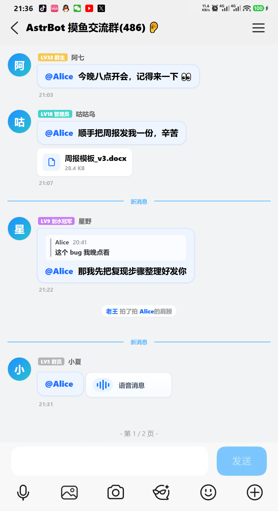

<div align="center">


# 艾特回声 · Mention Echo

**记录群里谁艾特过你，回群自动补发提醒，并把这些消息还原成一张聊天记录截图。**

内置自动清理与存储配额 —— 装上之后，不用再操心它悄悄吃掉多少硬盘。

[](https://github.com/Whereis-Alice/astrbot_plugin_mention_echo/releases)
[](https://github.com/AstrBotDevs/AstrBot)
[](LICENSE)
[](https://github.com/Whereis-Alice/astrbot_plugin_mention_echo/actions/workflows/ci.yml)
[](#兼容性)

</div>

---

## 这个插件解决什么问题

群里消息刷得飞快，有人 @ 了你，等你回来往上翻十屏也未必找得到。

- **只看到一个红点，不知道是谁、在说什么。**
  发一句 `谁艾特我`，插件会把每一条 @ 你的消息连同引用、图片、语音、文件、拍一拍都还原成一张聊天截图，一眼看完。
- **你不在的那段时间，@ 全错过了。**
  插件会判断你「离开」过，等你下次在群里说话时，自动把错过的 @ 补发给你，可选带上前后文。
- **久没看群，想一口气把最近几次 @ 都补上。**
  在命令后面加个数字：`谁艾特我 3` 只给最近 3 次，还能连同**当时那段群聊上下文**一起还原 —— 不只是 @ 你的那一句，而是那一段对话。
- **这类插件跑久了会把硬盘吃光。**
  这是本项目诞生的直接原因。上游把图片的 **base64 原文直接写进了数据库**，而清理逻辑只盯着磁盘目录，
  时间一长数据库能涨到 1 GB 以上。本版把存储改成「**数据库只存引用，图片字节只落磁盘**」——
  记录里只保留轻量引用，加上默认开启的自动清理与三层配额，见 [存储占用与自动清理](#存储占用与自动清理)。

## 长什么样

<div align="center">

<br />
<sub>发一句「谁艾特我」得到的结果图（示例数据）</sub>
</div>

## 亮点

| 能力 | 说明 |
| --- | --- |
| 🪶 **真的轻量** | 数据库里只存引用，图片字节只落磁盘。普通记录通常只是几 KB 文本和元数据；就算有图片和上下文，图片原始字节也不会混进数据库。 |
| 🧹 **自动清理 + 三层配额** | 后台每 6 小时巡检：过期记录、超量图片、孤儿数据键一起收掉，还会把历史遗留在数据库里的图片原文剥出来。容量按 `renders 64MB` / `message_images 128MB` / `总计 256MB` 强制封顶。你上传的字体和自定义图片永远不会被删。 |
| 🖼️ **t2i 优先出图** | 默认走 AstrBot 的 t2i 出图服务，不占机器人进程内存、也不必装 Chromium；失败自动回退本地浏览器，并冷却 180 秒，不会每次查询都白等一遍超时。 |
| 📬 **离线补发提醒** | 被 @ 的时候你不在，回群说话时自动补发；可按群、按人开关，也可以只发给白名单。 |
| 🕒 **一条命令两种用法** | `谁艾特我` 看全部；`谁艾特我 3` 只看最近 3 次，久没看群补课用它。成功时只发结果图片；要不要带上当时的群聊上下文，配置里一键切换。 |
| 🏆 **艾特排行榜** | `艾特排行榜 7` 看最近 7 天谁最爱 @ 你。纯文本输出，不出图、不额外占空间。 |
| 🎨 **可视化外观设置** | AstrBot WebUI 里直接拖坐标、调字号、加粗、换字体、换头尾图，所见即所得。 |
| 🤖 **可选的 LLM 工具** | 允许大模型在用户自然语言提问时自己去查「最近谁 @ 我」。**默认关闭**，涉及隐私，开启前请看说明。 |
| 🔁 **平滑迁移** | 自动继承「谁艾特我 / 谁艾特我 Pro」的历史记录和外观设置，命令也完全兼容，换过来不用重新教群友。 |

## 安装

把整个插件目录放进 AstrBot 的 `data/plugins/`，然后在 WebUI 的「插件管理」里点重载：

```bash
cd AstrBot/data/plugins
git clone https://github.com/Whereis-Alice/astrbot_plugin_mention_echo.git
```

- 需要 **AstrBot >= 4.16（<5）**。
- **默认的 t2i 出图不需要任何额外依赖。** 只有你把渲染方式切到「本地浏览器渲染」时，才需要环境里有 Playwright / Chromium。
- 装完直接可用，默认配置就是推荐配置，不改也行。

## 命令一览

所有命令**带不带前缀都一样**：`谁艾特我`、`/谁艾特我`、`#谁艾特我`、`!谁艾特我` 完全等价（支持 `/` `／` `#` `＃` `!` `！`）。下面为了好读统一不写前缀。

### 查询与帮助

| 命令 | 作用 | 谁能用 | 输出 |
| --- | --- | --- | --- |
| `谁艾特我` `谁@我` `谁at我` `哪个逼艾特我` | 查谁艾特过我 | 所有人 | 图片，多了会自动分页 |
| `谁艾特我 3` `谁艾特我3次` `谁艾特我 12 条` | 只看最近 N 次艾特（N 可填 1–50），久没看群补课用这个 | 所有人 | 图片 |
| `谁艾特他 @某人` | 查谁艾特过指定的人 | 所有人 | 图片 |
| `艾特回顾` `回顾艾特` `艾特补课` `at_recap` `catch_up` | 上面几条命令的别名，完全等价；不带 @ 查自己，带 @ 查对方 | 所有人 | 同上 |
| `艾特排行榜` `艾特排行榜 7` `谁最常艾特我` `艾特排名` `at_rank` | 最近谁最爱 @ 我（Top 10，天数可填 1–365） | 所有人 | 纯文本 |
| `艾特帮助` `at_help` `help_at` | 图文帮助 | 所有人 | 图片 |

### 提醒开关

| 命令 | 作用 | 谁能用 |
| --- | --- | --- |
| `开启本群艾特提醒` `关闭本群艾特提醒` | 整个群的提醒总闸 | 群管 / 主人 |
| `开启我的艾特提醒` `关闭我的艾特提醒` | 只管自己收不收（`我的`可省略） | 本人 |
| `艾特提醒状态` | 看当前群和自己的开关状态 | 所有人 |
| `开启提醒上下文` `关闭提醒上下文` | 提醒图里是否带被 @ 消息的前后文 | 群管 / 主人 |
| `设置提醒上下文 2,2` | 前文 2 条、后文 2 条（各 0–5） | 群管 / 主人 |
| `开启艾特上下文` `关闭艾特上下文` | 主动查询时是否带前后文 | 群管 / 主人 |

### 数据与存储

| 命令 | 作用 | 谁能用 | 输出 |
| --- | --- | --- | --- |
| `艾特存储` `艾特占用` `at_usage` | 看插件到底占了多少空间、离配额还有多远 | 群管 / 主人 | 纯文本 |
| `艾特清理` `立即清理艾特数据` `at_cleanup` | 立刻跑一次完整清理 | **AstrBot 管理员 / 主人** | 纯文本 |
| `清除艾特数据` `clear_at` | 删掉**我自己**的艾特记录 | 本人 | 纯文本 |
| `清除全部艾特数据` `clear_all` | 删掉**所有人**的记录（不可恢复） | **AstrBot 管理员 / 主人** | 纯文本 |

## 久没看群怎么补课

好几天没进群，光看被 @ 的那一句常常看不懂在讲什么。不用换命令，在后面加个数字就行：

```
谁艾特我 3      # 只看最近 3 次艾特
艾特回顾 3      # 别名，效果完全一样
```

**加数字和不加数字，只差查看范围：**

| 命令 | 查看范围 | 成功输出 |
| --- | --- | --- |
| `谁艾特我` | 存着的全部记录，多了自动分页 | 结果图片 |
| `谁艾特我 3` | 最近 3 次（可填 1–50） | 结果图片 |

查询成功时不会再额外发“稍等”、条数摘要或其它文本；只有 t2i、浏览器和图片发送都失败时，才会回退为纯文字记录，避免完全没有结果。

### 要不要带上前后的群聊记录

由 `record` 里的 **`查询时是否连带艾特前后的群聊记录`** 决定，和条数无关：

| 填 | 效果 | 适合 |
| --- | --- | --- |
| `跟随群设置`（默认） | 只有群里发过 `开启艾特上下文` 才采集并展示 | 大多数群 |
| `始终展示` | 从设置生效后，自动为新艾特采集并展示上下文 | 你就是那个久不看群的人 |
| `从不展示` | 不采集也不展示上下文，只看被 @ 的那一条 | 只想知道「谁找我」 |

几件需要知道的事：

- 上下文得**先存下来才看得到**。`始终展示` 会从设置生效后的新消息开始自动采集；`跟随群设置` 则需要群管 / 主人先发一次 `开启艾特上下文`。两种方式都**不能把历史补回来**。
- `从不展示` 会停止为手动查询采集新的上下文；群里的上下文开关会保留，日后改回“跟随群设置”时仍可继续使用。它不影响提醒上下文。
- 前后各取几条由 `record.查询上下文条数` 决定，默认前后各 5 条。调小后会立即限制已有记录的查询显示，之后的新记录也只保存该数量；调大无法补回过去没有采集的群消息。
- 每次艾特及其前后文都是独立片段，片段之间用无文字分割线隔开，避免把后一条艾特的前文误认成上一条的后文。
- 想让 `谁艾特我` 默认就是补课视图，把 `record.查询默认只看最近多少次艾特` 设成 3。命令里写的数字优先级更高。
- **查询上下文和提醒上下文不是同一个开关。** `record` 的查询上下文用于手动 `谁艾特我`；`reminder.默认开启提醒截图上下文` 只用于“你回群后自动补发”的提醒队列。两者可以同时开启，互不覆盖，前后文条数也各自独立。
- 因此，只打开“默认开启提醒截图上下文”并不会让手动查询带上群聊记录；希望自动补课，请把查询上下文设为 `始终展示`。
- 提醒上下文也**不会自动开启提醒本身**。要产生回群提醒，仍需同时允许本群提醒和目标用户提醒；可以发 `艾特提醒状态` 看当前群和自己的实际开关。

## 存储占用与自动清理

这是本版相对上游改动最大的地方，值得单独说清楚。

### 空间是被什么吃掉的

先说结论：**大头在数据库里，不在图片目录里。**

上游把消息里的图片转成 base64 原文，直接塞进那条艾特记录，跟着记录一起进数据库。于是：

- 一张 4 MB 的群图，进库就是一条 4 MB 的 JSON。个别路径下还会**同一张图存两遍**（`images` 和 `image_cache.source` 各一份，8 MB）。
- 记录过期时只 `pop` 掉了其中一份，`images` 里那份**永不释放**。
- 配合「每人每群最多 300 条」，单个「群 + 人」组合的理论上限就是 300 条带原图的记录，约 **1.2 GB**。
- 而上游的清理只扫磁盘目录和记录条数，**根本没看数据库**。所以你会看到「图片目录没多大，占用却上了 G」。

磁盘那边是另外几处，相对好理解：

```
astrbot_plugin_mention_echo/
├─ renders/              # 出图产生的临时图片（发完就没用了）
├─ message_images/       # 缓存的消息原图，用来在结果图里还原
├─ resources/            # 你上传的字体、自定义头尾图 —— 自动清理绝不碰这里
└─ page_settings.json    # 外观设置
```

外加数据库里的**群成员昵称缓存**：上游**只写不删、没有索引、永不过期**，群多人多的话会默默堆成另一个大头。

### 本版怎么治

**第一层：数据库里只许放引用。** 图片字节只躺在磁盘上，记录里存的永远是这三种之一：

| 记录里存的 | 含义 |
| --- | --- |
| `https://...` | 平台原始链接，需要时现取现下 |
| `mecache://YYYYMMDD/xxxx.jpg` | 指向本地缓存文件的相对路径 |
| `mecache://expired` | 原图已按策略释放，渲染时显示占位 |

写库前有一道统一闸门：任何字段（包括嵌套的引用消息、上下文、卡片封面）里只要出现超过 1024 字符的图片原文，就地剥离换成引用；纯文本字段也截断在 2000 字符。**不管消息长什么样，数据库都不会被图片撑大。**

**第二层：只为最近 N 条记录保留原图文件**（默认 20 条，配置项 `record.最近多少条记录缓存图片`）。

为什么不干脆全靠链接？因为 **QQ 的图片链接带 rkey，会轮换失效** —— 只留链接的话，隔天再查就是一张破图。所以近期的留一份本体在磁盘上，更早的退化成 `mecache://expired` 占位。

开启上下文也不会让每一条普通群聊图片都落盘：它们先只保留轻量 URL 或过期占位；只有消息本身成为艾特记录，或正在补充某条艾特的后文时，才进入受配额控制的图片缓存。

同一张缓存图可能同时被正式记录、多个被 @ 对象和待发提醒使用。为避免其中一条先过期就把其他记录的图删坏，记录淘汰时会先断开引用；没有任何记录引用的物理文件由下一轮自动巡检安全回收，并继续受图片缓存和总配额限制。

**第三层：后台巡检。** 开箱即用，不用配置：

- **定时**：启动 60 秒后跑第一次，之后每 6 小时一次，不阻塞消息处理。
- **按时间过期**：艾特记录保留 **30 天**（连带图片文件一起删）；成员昵称缓存保留 **14 天**（过期后下次查询自动重新拉取，对使用没有影响）。
- **按容量封顶**（超了就从最旧的开始删）：

  | 目标 | 上限 | 超出时的行为 |
  | --- | --- | --- |
  | `renders/` | 64 MB | 删最旧的临时图 |
  | `message_images/` | 128 MB | 按日期删最旧的那一天 |
  | 受管目录合计 | 256 MB | 兜底：单项都没超但总量超了，继续删最旧的 |

- **数据库瘦身**：顺手扫一遍历史记录，把老版本残留在库里的图片原文剥掉。**已经涨到 1 GB 的旧库，装上本版会被逐轮自动瘦下来，不需要手动清空数据。**
- **回收孤儿数据**：删掉不再被任何索引引用的历史键（旧版本残留、群解散后的遗留），并顺手修正索引。只动本插件自己的键。
- **单轮限流**：一次巡检最多删 2000 个 KV 键，剩下的顺延到下一轮，避免长时间占住数据库写锁。
- **宽限期保护**：刚落盘（正在渲染 / 正在下载）的文件不参与任何删除，宁可暂时超一点配额。
- **`resources/` 永不删除**：你上传的字体和自定义图片是你自己的东西，任何自动清理都不会动它。

所有容量上限和记录保留项都能在插件配置的 `maintenance` 段里改；标明可填 `0` 的项目才表示“不限制”，清理间隔等时间参数仍有安全下限。

### 到底占多少空间和内存

内存和记录文本长度、上下文条数、一次查询的页数有关，不能诚实地报一个所有群都适用的固定数字；但占用结构是确定的：

| 场景 | 本插件的主要占用 |
| --- | --- |
| 平时记录 | KV 中是 QQ 号、时间、短文本、图片 URL 或 `mecache://` 引用。普通记录通常是数 KB，不含任何原图 base64。 |
| 查一个攒满的会话 | 查询会临时读入该“群 + 被 @ 用户”的记录列表。按 300 条、每条约 1–10 KB 的常见文本量估算，Python 对象和 JSON 解码通常在约 **0.3–3 MB** 量级；文本会在 2000 字符处截断。 |
| t2i 出图 | HTML 交给宿主机的 t2i 服务，浏览器进程不需要常驻在 AstrBot 里；插件侧主要保留请求、结果图路径和短时间的渲染数据。 |
| 本地浏览器兜底 | Chromium 本身可能占用几十到数百 MB，这是可选的降级路径。只使用 `API渲染` 时不会启动它。 |

磁盘上的原图由 `message_images 128 MB` 和总配额 `256 MB` 双重兜底；数据库中的记录只保存引用。`tests/test_storage.py` 会回归检查“图片字节不进库”和“清理同时处理 `images` 与旧 `image_cache`”两条不变量。

插件自己的运行时缓存也有限制：维护锁最多 512 项、群活跃度表最多 4096 项、成员昵称缓存 300 秒 TTL；维护任务会回收空闲项，避免随着运行时间无限增长。

### 随时自查

`艾特存储` 会给你一份体检报告：

```
艾特回声 · 存储状态

成图缓存 renders：3.4 MB（12 个文件 / 上限 64 MB）
图片缓存 message_images：18.7 MB（243 个文件 / 上限 128 MB）
受管目录合计：22.1 MB / 总配额 256 MB
用户资源 resources：6.2 MB（3 个文件，自动清理不会删除）

记录数据：2841 条 / 37 个会话，约 2.4 MB
待发提醒：12 条 / 5 个会话｜上下文开启：3 个群｜成员缓存：512 条
最早记录：2026-08-09 20:14（保留 30 天）

上次清理：2026-09-06 15:02｜释放 12.8 MB｜删除 214 个文件｜数据库瘦身 47.3 MB
自动清理：开启（每 6 小时）｜成员缓存保留 14 天
```

不想等下一轮，`艾特清理` 立刻跑一遍：

```
艾特回声 · 清理完成（耗时 0.42s）

删除文件 214 个，释放 12.8 MB
数据库瘦身：剥离图片原文 47.3 MB
清理过期/超量记录 96 条
回收 KV 键 341 个（成员缓存 305，孤儿键 36）
索引重建 4 处，扫描键 1288 个
当前占用：renders 0.3 MB｜message_images 15.2 MB
```

那行「数据库瘦身 47.3 MB」就是从上游继承的旧数据里，把图片原文剥出去省下来的空间。

## 图片渲染

### 默认：t2i 优先

出图默认走 **AstrBot 的 t2i 服务**（把 HTML 交给远端渲染成图）。好处是不占机器人进程的内存、不必在服务器上装 Chromium，自建 t2i 的话通常还更快。

- t2i 的地址在 **AstrBot 全局设置**里的 `t2i_endpoint`，不是本插件的配置项。默认是官方的 `https://t2i.soulter.top/text2img`，你也可以填自建服务。
- **t2i 出图失败会自动回退本地浏览器**，同时进入 **180 秒冷却**：冷却期内的查询直接先用本地浏览器，不再重复白等一次超时；冷却结束后自动重试，成功一次立刻恢复优先。
- t2i 下载回来的图片会被搬进插件自己的 `renders/` 目录纳入清理管理，不会散落在 AstrBot 的公共临时目录里。
- 多页查询走 t2i 时会**并发出图（上限 3）**，页数多的时候明显更快。

### 想换成别的方式

在插件配置的 `render` 段里：

| 想要的效果 | 怎么配 |
| --- | --- |
| 保持默认（推荐） | `渲染方式 = 自动`，`优先使用本地浏览器渲染 = 关` |
| 先用本地浏览器，失败再试 t2i | `渲染方式 = 自动`，`优先使用本地浏览器渲染 = 开` |
| 只用 t2i，绝不启动浏览器（最省内存） | `渲染方式 = API渲染` |
| 完全离线，不发请求到外部 | `渲染方式 = 本地浏览器渲染` |
| 干脆不出图 | `渲染方式 = 纯文字` —— 改用合并转发消息展示，平台不支持合并消息时只发一条短提示 |

输出统一优先 **JPEG**（`image_quality` 默认 92），比 PNG 省一大截空间；只有在 JPEG 路径失败时才兜底 PNG。
## 配置说明

在 AstrBot WebUI 的插件配置页里改，分 7 段。下表列出默认值和要点，WebUI 里每一项都有更详细的说明。

### `global` 全局

| 配置 | 默认 | 说明 |
| --- | --- | --- |
| 允许使用插件的群 UMO 白名单 | 空 | 留空 = 所有群可用。填了之后，只有名单里的群会记录、查询、提醒 |

### `feature` 功能开关

| 配置 | 默认 | 说明 |
| --- | --- | --- |
| 启用艾特排行榜 | 开 | 关掉后 `艾特排行榜` 命令不再响应 |
| 允许 LLM 主动查询艾特记录 | **关** | 见下方 [LLM 工具](#llm-工具默认关闭)。改完需要重载插件 |
| 输出图片解析诊断日志（`feature.image_diagnostics_enabled`） | **关** | 默认不输出逐条 `record image diagnostic` / `query image diagnostic` 日志。只有排查图片或 OneBot 消息段兼容问题时才临时打开 |

### `record` 记录与查询

| 配置 | 默认 | 说明 |
| --- | --- | --- |
| 每人最多保留的记录数 | 300 | 超出保留最新的 |
| 最近多少条记录缓存图片 | 20 | 只为最近 N 条记录在磁盘上保留原图。**数据库里永远只存引用，与这一项无关。**填 0 = 完全不落盘，但 QQ 链接会失效，隔天再查可能是破图 |
| 图片缓存保留小时数 | 24 | 0 或更小 = 禁用这项定时清理 |
| 单张图最多几条消息 | 12 | 超了自动分页 |
| 单次查询最多几页 | 0 | 0 = 不限制 |
| 查询上下文条数 | 5 | 每次艾特的前文、后文各最多多少条；调小立即限制查询显示和后续保存，调大不能补回历史 |
| 查询时是否连带艾特前后的群聊记录 | 跟随群设置 | `跟随群设置` = 需要群管发过 `开启艾特上下文`；`始终展示` = 从设置生效后自动采集并展示新艾特的上下文；`从不展示` = 只看被 @ 的那一条。历史不能补录，**只影响查询** |
| 查询默认只看最近多少次艾特 | 0 | 0 = 全部记录（分页）。设成 3 就等于 `谁艾特我` 默认只看最近 3 次；成功时仍只发结果图片，命令里写的数字优先 |
| 排序方式 | 正序 | 正序 = 旧的在上；倒序 = 最新的在上 |

### `reminder` 回群提醒

| 配置 | 默认 | 说明 |
| --- | --- | --- |
| 新群默认开启提醒 | 开 | 关掉后仍可用 `开启本群艾特提醒` 单独开 |
| 限定开启提醒的群 UMO | 空 | 留空不限制 |
| 用户默认接收提醒 | 开 | 用户自己可以 `关闭我的艾特提醒` |
| 用户白名单 / 黑名单 | 空 | **黑名单优先于白名单**；只影响被动提醒，不影响手动查询 |
| 离开判定分钟数 | 10 | 被 @ 之后超过这么久你才回来，才算「错过」 |
| 触发所需的最少群消息数 | 5 | 与离开时间**同时满足**才提醒；0 = 不看消息数 |
| 每人每群最多待提醒数 | 50 | 超出保留最新的 |
| 单次提醒最多几页 | 0 | 0 = 不限制 |
| 默认带上下文 / 前文 / 后文 | 关 / 1 / 1 | **只控制回群自动提醒**，也可以用群命令单独调；不会让手动查询自动记录上下文 |
| 上下文最大条数 | 5 | 群命令和 Web 设置都受它限制 |

### `render` 渲染

见上一节 [图片渲染](#图片渲染)。默认值：`渲染方式=自动`、`优先使用本地浏览器渲染=关`、`JPEG 质量=92`、`单次渲染超时=25s`、`t2i 失败冷却=180s`、`页面超时=20000ms`、`渲染临时图保留=24h`。顶部/底部图片留空则用插件内置图，WebUI 上传的自定义图优先级更高。

### `maintenance` 自动清理

见上一节 [存储占用与自动清理](#存储占用与自动清理)。默认值：`开启`、`每 6 小时`、`启动后 60 秒首跑`、`记录保留 30 天`、`成员缓存保留 14 天`、`renders 64MB`、`message_images 128MB`、`总配额 256MB`、`清理孤儿键=开`。**每一项填 0 都表示不限制。**

### `message` 提示文案

| 配置 | 默认 | 可用变量 |
| --- | --- | --- |
| 回群提醒提示 | `{target_name}，你不在的时候有 {count} 条艾特记录~` | `{target_name}` `{count}` |

在“自动 / API渲染 / 本地浏览器渲染”模式下，查询成功时固定只发送结果图片，不提供等待提示或文字摘要。回群提醒提示可以留空；留空后只发送提醒图片。选择“纯文字”模式则是明确要求使用合并转发文本。

## 外观自定义

插件自带一个可视化设置页，在 AstrBot WebUI 的插件页面里打开（标题「艾特回声设置」）。能做的事：

- 拖动/微调顶部**时间**和**群名**的坐标与字号
- 调整字体**加粗强度**（0–120 的无级调节，不依赖字体本身有没有粗体）
- **上传并切换自定义字体**（想要什么风格换什么字体）
- **上传自定义顶部/底部图片**，也能一键恢复默认

上传的文件都在数据目录的 `resources/` 下，**自动清理永远不会删除它们**。

## LLM 工具（默认关闭）

打开 `feature.llm_tool_enabled` 后，插件会向大模型注册一个函数工具。群友用自然语言问「刚才谁叫我」时，模型可以自己去查**提问者本人在当前群**的最近艾特记录，返回纯文本摘要（最多 20 条，每条正文截断到 80 字）。

⚠️ **隐私提醒**：开启就意味着这些聊天片段会随对话一起发给你配置的模型服务商。默认关闭就是这个原因，请自行评估后再开。改完这一项需要**重载插件**才生效。

## 兼容性

- **平台**：目标是 **QQ OneBot v11**，通过 AstrBot 的 `aiocqhttp` 适配器接入。群成员头衔、等级和群人数通过 OneBot 接口获取。
- **已做协议回归**：标准 OneBot v11 事件，以及 **LLOneBot / LLBot** 常见的 `at`、`image`、`group_id` / `user_id` / `self_id` 字段；也兼容 **SnowLuma** 一类以 JSON 字符串传入 `messageChain`、使用 `mention_user` / `imageUrl` / `senderId` / `botId` 的事件形态。
- **协议动作**：兼容同步或异步的 `call_action` / `call_api`（可挂在 `bot`、`bot.api`、`bot.client`），查询图片所需的 `get_image` 等动作和多页转发的 `send_group_forward_msg` / `send_forward_msg` 都有回退路径。具体客户端仍需正常实现相应 OneBot v11 动作。
- **其他平台**：记录和出图仍然可用，但拿不到头衔/等级/群人数这类信息，会自动降级成事件里带的昵称。
- **AstrBot**：`>=4.16,<5`。

## 常见问题

**出不了图 / 一直发文字？**
先看日志。默认走 t2i，端点在 AstrBot 全局设置的 `t2i_endpoint`；如果端点不通，插件会回退本地浏览器，而本地浏览器需要 Playwright/Chromium。两条路都不通就只能出文字。想彻底离线，装好 Playwright 后把渲染方式设为「本地浏览器渲染」。

**为什么日志里一直有 `record image diagnostic`？**
这是图片解析排障日志，不是正常运行必需日志。v1.3.0 起默认关闭；重载插件后，只要 `feature.image_diagnostics_enabled`（WebUI 名称“输出图片解析诊断日志”）保持关闭就不会再逐条输出。需要排查图片、LLOneBot / LLBot / SnowLuma 消息格式时再临时打开。

**我开了提醒上下文，为什么 `谁艾特我 3` 还是没有群聊前后文？**
“提醒上下文”只服务于你回群后自动补发的提醒，和手动查询是两套记录。把 `record.查询时是否连带艾特前后的群聊记录` 设为 `始终展示`，从设置生效后的新艾特开始就会自动采集；或者让群管发送 `开启艾特上下文`。旧艾特发生时没有保存前后消息，无法逆向恢复。

**为什么第一次查询有点慢？**
本地浏览器渲染要拉起一次 Chromium；t2i 则取决于端点响应。之后会快很多。多页查询走 t2i 时是并发出图的。

**从上游换过来，占用为什么没马上降下去？**
旧数据里的图片原文是巡检时逐轮剥离的，不是装上就瞬间生效。发一句 `艾特清理` 可以立刻跑一轮，报告里的「数据库瘦身」就是这次剥出去的量。数据量大的话跑两三轮才会彻底干净（单轮有 2000 键的限流，防止长时间占住数据库写锁）。

**占用还是很大怎么办？**
先 `艾特存储` 看是哪一块大。`message_images` 大就把 `record.最近多少条记录缓存图片` 从 20 调小（填 0 = 完全不落盘，代价是隔天再查可能看到破图）。`记录数据` 那一行大就把 `maintenance` 的记录保留天数或 `record.每人最多保留的记录数` 调小。还嫌大就把三个容量上限一起压低。

**这插件吃多少内存？**
很少。一条记录常驻约 3 KB，一个攒满 300 条的会话全读进来 0.67 MB，一次查询的临时峰值 15.8 KB。详见 [到底占多少空间和内存](#到底占多少空间和内存)。

**以前的 `艾特回顾` 怎么没了？**
还在，只是变成了 `谁艾特我` 的别名——`艾特回顾`、`回顾艾特`、`艾特补课`、`at_recap`、`catch_up` 全部等价于 `谁艾特我`，后面同样可以跟数字。v1.1.0 里「最多回顾 5 次、强制带上下文」的限制取消了，改由 `record` 的两个配置项接管，见 [久没看群怎么补课](#久没看群怎么补课)。

**提醒不触发？**
提醒要**同时**满足两个条件：被 @ 到你回来说话之间超过 `离开判定分钟数`（默认 10 分钟），且期间群里至少有 `触发所需的最少群消息数` 条消息（默认 5 条）。`艾特提醒状态` 可以看当前群和你自己的开关。还要确认自己不在黑名单里。

**能和「谁艾特我 Pro」同时开吗？**
⚠️ **不行。** 两个插件的触发词完全一样，同时启用会导致同一条命令被响应两次。请先停用/卸载原插件，再启用本插件。

**换过来会丢数据吗？**
不会，见下一节。

## 从「谁艾特我 / 谁艾特我 Pro」迁移

本插件是它的 fork，做了平滑迁移：

1. **停用或卸载原插件**（重要，见上面的 FAQ）。
2. 安装并启用本插件，重载。
3. 首次启动时会自动做两件事：
   - **继承历史艾特记录**（读取原插件的 KV 数据，**只读不删**，只做一次）；
   - **复制原插件的数据目录**（字体、自定义头尾图、页面设置），也只做一次，完成后在新目录留一个标记文件。
4. 命令**完全兼容**，群友照旧发 `谁艾特我` 就行，不用重新教。

> 因为第 3 步是**复制**而不是移动，原插件的数据目录还会占着原来的空间。确认新插件工作正常后，可以手动删掉 `data/plugin_data/astrbot_plugin_who_at_me_pro/`。

## 参与开发

改代码之前，先跑一遍自检脚本（都只用标准库，不需要装 AstrBot、也不需要 pytest）：

```bash
python tests/test_maintenance.py             # 清理逻辑自测
python tests/test_storage.py                 # 存储层自测（引用式存储 / 图片不进库）
python tests/test_query.py                   # 查询上下文 / 只发图回归
python tests/test_onebot_compat.py           # OneBot / LLOneBot / LLBot / SnowLuma 协议兼容
python .github/scripts/validate_manifest.py  # metadata / 配置项 / 更新日志 自洽性
```

- 清理是本插件唯一会**不可逆删除文件**的部分，改动 `modules/maintenance.py` 后请务必跑一遍上面的自测。
- **核心不变量：数据库里不许出现图片字节。** 只许是 http(s) 链接、`mecache://` 引用或过期占位，
  单条不超过 1024 字符。改 `modules/data.py` 的入库路径后必须跑 `tests/test_storage.py`。
- 所有自测都只用标准库、全程不联网，`python tests/xxx.py` 直接跑，不需要装 AstrBot 或 pytest。
- 代码按职责拆分在 `modules/` 下：`config`（读配置）、`data`（KV 存取）、`message`（解析消息）、
  `rendering`（出图）、`maintenance`（清理）、`page_api` / `page_settings`（WebUI 外观设置）。
- 本插件没有第三方硬依赖，`requirements.txt` 里写清了每个库由谁提供、哪个是可选的。
- 版本号写在 `metadata.yaml`，推到 `main` 后由 GitHub Actions 自动发 Release，
  说明取自 [CHANGELOG.md](CHANGELOG.md)。

## 致谢与许可

本项目 fork 自 [**astrbot_plugin_who_at_me_pro**](https://github.com/xiaoruange39/astrbot_plugin_who_at_me_pro)（作者 [@xiaoruange39](https://github.com/xiaoruange39)），在其基础上重写了存储治理、渲染链路与文档。感谢原作者做出了这么好用的底子。

本项目与上游同为 **MIT License**，详见 [LICENSE](LICENSE)。
